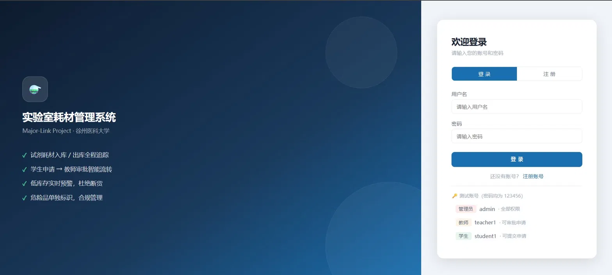
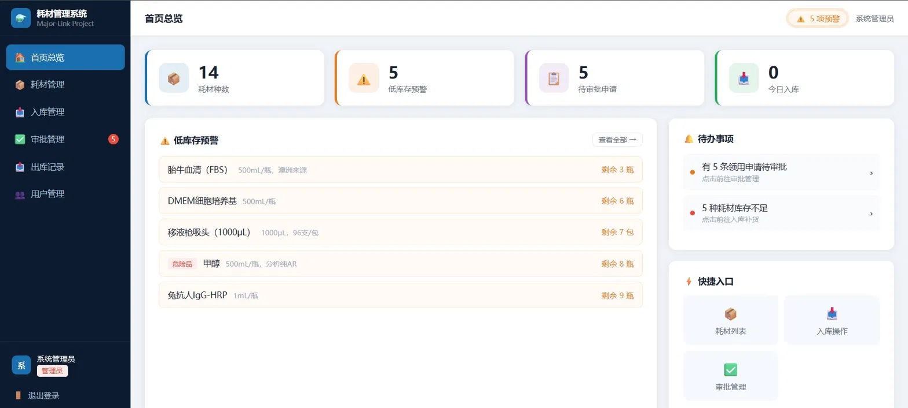
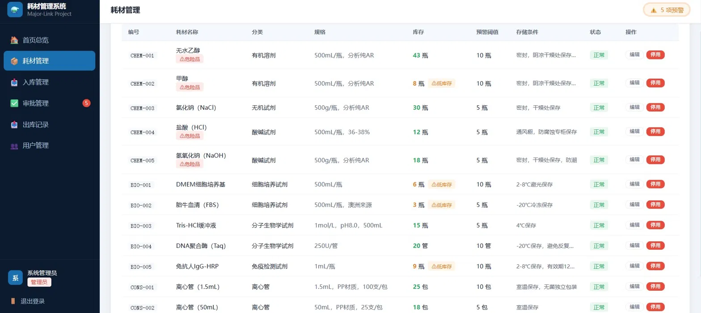
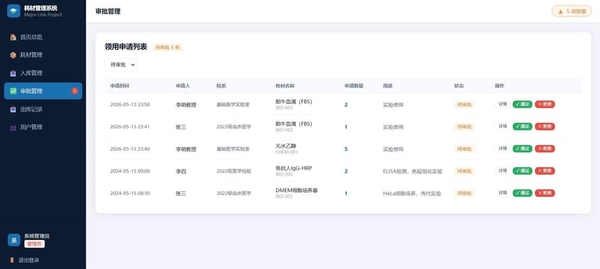

<div align="center">

# 🧪 实验室耗材管理系统

**Lab Supply Management System**

基于 Spring Boot 3 + MyBatis + MySQL 构建的医疗实验室耗材全生命周期管理平台

[](https://openjdk.org/)
[](https://spring.io/projects/spring-boot)
[](https://mybatis.org/)
[](https://www.mysql.com/)
[](LICENSE)

</div>

---

## 📸 项目截图

<table>
  <tr>
    <td align="center"><b>登录页</b></td>
    <td align="center"><b>首页仪表盘（低库存预警）</b></td>
  </tr>
  <tr>
    <td></td>
    <td></td>
  </tr>
  <tr>
    <td align="center"><b>耗材管理</b></td>
    <td align="center"><b>审批管理</b></td>
  </tr>
  <tr>
    <td></td>
    <td></td>
  </tr>
</table>


---

## 📖 项目简介

本项目是面向高校医学实验室场景设计的耗材管理系统，实现了从耗材入库、领用申请、教师审批到自动出库的完整业务闭环，并提供低库存首页预警，帮助管理员及时补货、避免断货。

前端采用原生 HTML/CSS/JS，无需任何构建工具，浏览器直接打开即可运行；后端以 Spring Boot 为核心，通过 JWT 实现无状态认证，使用 `@Transactional` 保证审批出库的数据一致性。

> **选题背景**：结合计算机科学与医学信息工程背景，相较于通用图书管理系统，实验室耗材场景具有更高的业务复杂度（危险品管控、批次追踪、审批流），是练习业务建模与工程实践的理想选题。

---

## ✨ 核心功能

| 模块 | 说明 |
|------|------|
| 🏠 首页仪表盘 | 耗材总数、待审批数、低库存预警列表、快捷入口 |
| 📦 耗材管理 | 新增、编辑、停用耗材，支持名称/编号/厂家模糊搜索 |
| 📥 入库管理 | 记录批次号、有效期、供应商，自动累加库存（仅管理员）|
| 📋 领用申请 | 学生填写数量与实验用途后提交，进入待审批队列 |
| ✅ 审批管理 | 教师一键通过/拒绝，通过后自动扣库存并生成出库记录 |
| 📤 出库记录 | 完整出库历史，支持按耗材筛选 |
| 👥 用户管理 | 管理员对账号的启用/禁用操作 |

---

## 🔄 审批流设计

```
学生提交申请
      │
      ▼
  [PENDING]  待审批
      │
      ├── 教师审批通过 ──► [APPROVED] ──► 扣减库存 + 写出库记录
      │                                        ↑
      │                              @Transactional 原子保证
      └── 教师审批拒绝 ──► [REJECTED]（必填拒绝原因，库存不变）
```

状态流转由 `supply_application.status` 字段驱动，审批通过时「更新申请状态 + 扣减库存 + 写出库记录」三步操作在同一事务内完成，任意步骤失败则整体回滚。

---

## 🏗️ 技术架构

```
┌──────────────────────────────────────┐
│        前端（原生 HTML / CSS / JS）     │
│  login · dashboard · supply · ...    │
└───────────────┬──────────────────────┘
                │  HTTP + JWT
┌───────────────▼──────────────────────┐
│           Spring Boot 3 后端          │
│                                      │
│   Controller → Service → Mapper      │
│   JWT 拦截器 → UserContext(ThreadLocal)│
└───────────────┬──────────────────────┘
                │
┌───────────────▼──────────────────────┐
│        MySQL 8.0（6 张业务表）          │
│    Druid 连接池 · MyBatis XML 映射      │
└──────────────────────────────────────┘
```

### 技术选型

| 层次 | 技术 | 版本 |
|------|------|------|
| 框架 | Spring Boot | 3.2.0 |
| 持久层 | MyBatis + PageHelper | 3.0.3 |
| 数据库 | MySQL | 8.0 |
| 连接池 | Druid | 1.2.20 |
| 认证 | JWT (jjwt) | 0.12.3 |
| 密码加密 | BCrypt (spring-security-crypto) | — |
| 构建工具 | Maven | 3.6+ |
| 运行环境 | JDK | 17 |

---

## 🗄️ 数据库设计

共 6 张核心业务表：

```
sys_user              用户表（角色：ADMIN / TEACHER / STUDENT）
supply_category       耗材分类表（支持两级分类）
supply_item           耗材主表（含库存数量与低库存预警阈值）
stock_in_record       入库记录表（批次号、有效期、供应商）
supply_application    领用申请表（审批流核心，状态机驱动）
stock_out_record      出库记录表（关联申请ID，记录领用人与操作人）
```

**防超卖设计**：出库使用条件更新，避免先查后改的并发问题：

```sql
UPDATE supply_item
SET quantity = quantity - #{delta}
WHERE id = #{id} AND quantity >= #{delta}
```

返回影响行数为 0 时说明库存不足，Service 层抛出业务异常，触发整个事务回滚。

---

## 🚀 快速启动

### 环境要求

- JDK 17+
- Maven 3.6+
- MySQL 8.0+

### 1. 克隆项目

```bash
git clone https://github.com/firefly-forever/lab-supply-system.git
cd lab-supply-system
```

### 2. 初始化数据库

```bash
mysql -u root -p < src/main/resources/db_init.sql
```

### 3. 修改数据库配置

编辑 `src/main/resources/application.yml`：

```yaml
spring:
  datasource:
    druid:
      url: jdbc:mysql://localhost:3306/lab_supply_db?useUnicode=true&characterEncoding=utf8&serverTimezone=Asia/Shanghai
      username: root
      password: your_password   # ← 改为你的 MySQL 密码
```

### 4. 修复测试账号密码（首次必做）

由于 BCrypt 使用随机 salt，需执行以下命令生成正确哈希值，将输出的 `UPDATE` 语句在数据库中执行一次：

```bash
mvn test -Dtest=LabSupplyApplicationTests#generatePasswordHash -Dsurefire.failIfNoSpecifiedTests=false
```

### 5. 启动后端

```bash
mvn spring-boot:run
```

启动成功后访问：`http://localhost:8080/api`

### 6. 启动前端

用 VS Code 打开 `lab-html-frontend/` 目录，右键 `index.html` → **Open with Live Server**。

> 也可直接双击 `login.html` 用浏览器打开；如遇跨域报错，改用 Live Server 即可解决。

---

## 👤 测试账号

密码均为 `123456`

| 用户名 | 角色 | 权限范围 |
|--------|------|---------|
| admin | 管理员 | 全部功能，含入库操作与用户管理 |
| teacher1 | 教师 | 审批申请、查看库存与出库记录 |
| teacher2 | 教师 | 同上 |
| student1 | 学生 | 提交领用申请、查看自己的申请记录 |
| student2 | 学生 | 同上 |
| student3 | 学生 | 同上 |

---

## 📁 项目结构

```
lab-supply-system/
│
├── src/main/java/com/majorlink/lab/
│   ├── LabSupplyApplication.java          启动类
│   ├── config/
│   │   ├── JwtUtil.java                   JWT 生成与解析
│   │   ├── JwtInterceptor.java            认证拦截器
│   │   ├── UserContext.java               ThreadLocal 用户上下文
│   │   ├── WebMvcConfig.java              拦截器注册 + 跨域配置
│   │   └── PasswordEncoderUtil.java       BCrypt 工具类
│   ├── common/
│   │   ├── result/                        统一响应封装 Result + ResultCode
│   │   ├── enums/                         角色、申请状态枚举
│   │   └── exception/                     BusinessException + 全局异常处理器
│   ├── entity/                            6 个数据库实体
│   ├── mapper/                            6 个 MyBatis Mapper 接口
│   ├── service/impl/                      业务逻辑层
│   ├── controller/                        REST 控制器
│   ├── dto/                               请求参数 DTO
│   └── vo/                                响应数据 VO
│
├── src/main/resources/
│   ├── application.yml                    配置文件
│   ├── db_init.sql                        建库建表 + 初始化数据
│   └── mapper/                            6 个 MyBatis XML 映射文件
│
├── lab-html-frontend/                     前端（原生 HTML/CSS/JS，无需构建）
│   ├── login.html                         登录 / 注册
│   ├── dashboard.html                     首页仪表盘
│   ├── supply.html                        耗材管理
│   ├── stockin.html                       入库管理
│   ├── application.html                   领用申请
│   ├── approve.html                       审批管理
│   ├── stockout.html                      出库记录
│   ├── user.html                          用户管理
│   ├── config.js                          全局配置 + API 封装 + 工具函数
│   ├── layout.js                          侧边栏渲染 + 预警角标
│   └── style.css                          全局样式
│
├── docs/screenshots/                      ← 截图放这里
└── pom.xml
```

---

## 🔑 主要接口

| 方法 | 路径 | 说明 | 权限 |
|------|------|------|------|
| POST | `/api/auth/login` | 登录 | 公开 |
| POST | `/api/auth/register` | 注册 | 公开 |
| GET | `/api/dashboard` | 首页数据（含低库存预警） | 全员 |
| GET | `/api/supply/list` | 耗材列表（分页 + 搜索） | 全员 |
| POST | `/api/supply` | 新增耗材 | 管理员 |
| PUT | `/api/supply` | 编辑耗材 | 管理员 |
| POST | `/api/stock/in` | 入库操作 | 管理员 |
| POST | `/api/stock/apply` | 提交领用申请 | 学生 |
| POST | `/api/stock/approve` | 审批申请 | 教师 / 管理员 |
| GET | `/api/stock/application/list` | 申请列表 | 全员（学生限本人） |
| GET | `/api/stock/out/list` | 出库记录 | 教师 / 管理员 |

> 所有需要认证的接口均在请求头携带：`Authorization: Bearer <token>`

---

## 💡 设计亮点

**① 审批流状态机**
`supply_application.status` 严格限定转换路径（PENDING → APPROVED / REJECTED），审批 SQL 加入 `WHERE status = 'PENDING'` 约束，从数据库层防止重复审批。

**② 事务原子性**
`StockServiceImpl.approveApplication()` 标注 `@Transactional`，审批通过时「状态变更 + 库存扣减 + 出库记录写入」三步在同一事务内完成，任意失败整体回滚。

**③ 防并发超卖**
出库使用 `UPDATE ... WHERE quantity >= delta` 的原子 SQL，影响行数为 0 则抛出业务异常，无需加锁即可保证数据一致。

**④ ThreadLocal 用户上下文**
JWT 拦截器解析 Token 后将用户信息存入 `UserContext`（ThreadLocal），Service 层直接调用 `UserContext.getCurrentUserId()`，无需通过接口参数传递 userId，从根本上杜绝越权风险。

**⑤ 低库存预警**
每种耗材可独立设置 `warning_quantity` 阈值，首页通过 `SELECT ... WHERE quantity <= warning_quantity` 实时查询，库存不足时在仪表盘醒目展示。

---

## 📄 License

[MIT](LICENSE) © 2024 [firefly-forever](https://github.com/firefly-forever)
